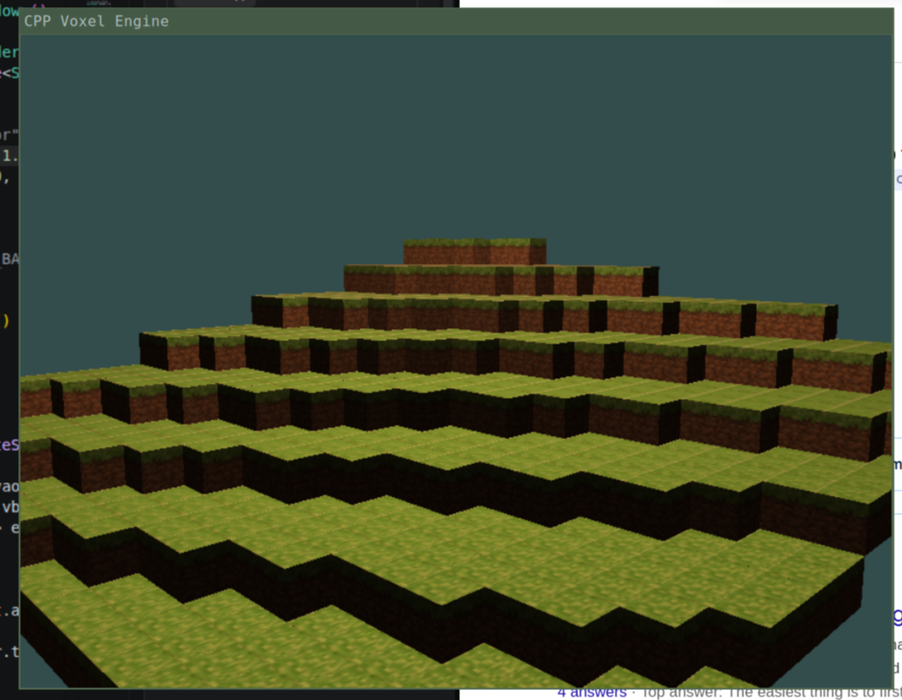

# C++ Voxel Engine

A WIP voxel engine I built from scratch in C++ to teach myself OpenGL 3.3 Core Profile, the graphics pipeline, and GPU resource management.



## Overview

This project is a procedurally generated voxel terrain renderer. It directly interfaces with the OpenGL API (no engine or abstraction layer) to manage the full rendering pipeline: shader compilation, GPU buffer allocation, texture upload, matrix transformations, and draw call submission.

## Graphics

### Graphics Pipeline

- **API:** OpenGL 3.3 Core Profile, loaded at runtime via GLAD
- **Shaders:** Custom GLSL 330 vertex and fragment shaders
  - Vertex shader applies model/view/projection matrix transformations
  - Fragment shader performs texture sampling
- **Buffer Management:** Manual creation and lifecycle management of VAOs, VBOs, and EBOs using `glGen*` / `glBind*` / `glBufferData` / `glDelete*`
- **Texture Pipeline:** Texture loading from disk, pixel format handling, GPU upload via `glTexImage2D`, and mipmap generation with trilinear filtering (`GL_LINEAR_MIPMAP_LINEAR`)
- **Depth Testing:** Hardware depth buffer for correct draw ordering

### GPU Resource Management

OpenGL GPU-side objects (vertex arrays, vertex buffers, element buffers) are wrapped in C++ **RAII** classes that tie GPU resource lifetime to object scope:

```cpp
class VertexArray {
    GLuint id;
    VertexArray()  { glGenVertexArrays(1, &id); }
    ~VertexArray() { glDeleteVertexArrays(1, &id); }
};
```

### Vertex Specification & Memory Layout

Vertex data is laid out as interleaved position and texture coordinate attributes in a contiguous buffer:

```
Stride: 5 floats (20 bytes)
[pos.x, pos.y, pos.z, tex.u, tex.v] per vertex
```

Vertex attribute pointers are configured manually with explicit stride and offset calculations, directly specifying how the GPU should interpret the raw buffer memory.

### Procedural Terrain Generation

- Chunk-based world system (16x16 block chunks)
- Terrain heightmap generated using multi-octave 2D Perlin noise (4 octaves at 0.01 frequency scale)
- Dynamic chunk loading/unloading based on camera position with a configurable render distance

### Camera System

- Euler angle-based free camera (yaw/pitch) with trigonometric direction vector computation
- View matrix constructed via `glm::lookAt` each frame
- Perspective projection with configurable FOV
- Delta-time-scaled movement for frame-rate-independent input

### Build System & Platform Integration

- **Compiler:** g++ with C++20 and `-O2` optimization
- **Platform:** Linux (Sway WM, may not be currently compatible with other WM's)
- **Linked system libraries:** `libGL`, `libglfw`, `libX11`, `libXrandr`, `libXi`, `libdl`, `libpthread`
- **Build:** GNU Make with per-object compilation and linking

### Dependencies

| Library | Role |
|---------|------|
| [GLAD](https://glad.dav1d.de/) | OpenGL function pointer loading at runtime |
| [GLFW](https://www.glfw.org/) | Window creation, OpenGL context management, input callbacks |
| [GLM](https://github.com/g-truc/glm) | Linear algebra (vectors, matrices, transformations) |
| [Dear ImGui](https://github.com/ocornut/imgui) | Debug/development UI overlay |
| [stb_image](https://github.com/nothings/stb) | Image decoding for texture loading |
| [PerlinNoise](https://github.com/Reputeless/PerlinNoise) | Procedural noise generation |

## Planned Improvements

- [ ] Greedy meshing to reduce per-chunk triangle count
- [ ] Frustum and occlusion culling
- [ ] Batch draw calls to minimize CPU-GPU command submission overhead
- [x] Diffuse Lighting
- [ ] Shadows
- [ ] Chunk geometry caching to avoid vertex recomputation
- [x] Code refactoring and separation of rendering and world logic

## Building & Running

```bash
make
```
Will produce a "voxel" binary.
Requires `libglfw3-dev`, `libgl-dev`, and X11 development headers on Linux.
